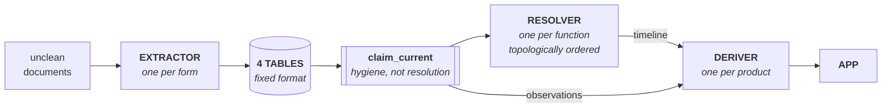

# Decoder architecture

**The four tables are the contract.** Extractors plug in above it, resolvers below
it. Every agent writes the same shape; they differ only in how they break their
own source document down to get there.

    source_document   what was fetched, whether the fetch worked, and — if it
                      produced nothing — why  (`barren_reason`)
    claim             the assertion: kind, value or term, subject, as_of,
                      provenance, lifecycle, geometry
    proof             the crop, WITH ITS REGION  (one crop can prove many claims)
    party             the person/entity axis

---

## The three steps

**EXTRACTOR** — document in, rows out. One per form: BIS PW1, BIS ZD1, DOB NOW PW1,
ACRIS deed, ACRIS mortgage. Knows its form's geometry and traps, knows nothing
about history or other documents. Writes `subject_raw` and `name_raw` exactly as
printed, and **records where on the page it read each fact**.

**RESOLVER** — bundles extractions into a function. One per function. Reads claims,
and may read another resolver's *output* where the register declares a dependency —
never another resolver's internals, never a document. Settles conflicts, closes
gaps, assigns canonical ids. Outputs a timeline, not an answer.

**DERIVER** — packages what the app wants to display. One per product. Writes
nothing durable. Reads a resolver's **timeline** when the question needs a
conflict settled, or an **observation set** straight off `claim_current` when the
spread is itself the answer — see below.

---

## The claim row

A term and a value are the same assertion at different densities — a rights
reallocation clause is both a formula and a percentage. They share one row.

    kind            QUANTITY · IDENTIFIER · PARTY · TERM_REF · ASSERTION
    assertion_type  PRIMARY · RECITAL · DERIVED
    predicate · value_num | value_text · unit · subject_raw · as_of
    modality · actor · condition · exception · consent_of
    status · trigger
    geometry        v_from · v_to · v_datum · h_extent · duration
    page · region · verbatim · evidence

⚠ **`kind` and `assertion_type` are the two that carry the most weight.**
A dollar figure in a mortgage schedule is often a *pointer to an earlier lien*,
not this instrument's amount; without `kind`, no resolver separates new money
from a recital of old money. And PRIMARY outranks RECITAL **regardless of count** —
a 1990 instrument states its own tax twice, while a 2003 and a 2014 affidavit each
restate it differently. Majority vote returns the wrong answer 2–1.

⚠ **`verbatim` is not optional.** The words *are* the fact. "Upper" versus "lower"
limiting plane is one word and it reverses which volume was conveyed.

---

## Two ways a deriver may read

A deriver takes either an **observation set** or a **timeline**, and the
choice is not raw-versus-clean. It is:

★ **Does this question need a conflict SETTLED, or is the disagreement the
product?**

    OBSERVATIONS   claim_current, filtered by function. Every observation
                   stands, nothing adjudicated. USE WHEN THE SPREAD IS THE
                   ANSWER — residential lease comps are a distribution, not
                   a question with one answer. Resolving them destroys the
                   thing being measured.

    TIMELINE       a resolver's output. Conflicts settled, ordered, NOT
                   collapsed. USE WHEN ONE ANSWER IS REQUIRED — "is this
                   variance still live" has exactly one truth and getting it
                   wrong is the whole risk.

Worked both ways:

    Comparables   OBSERVATIONS   forty leases with their variance intact
    Entitle       TIMELINE       granted · conditions · expiry · status now
    Air rights    TIMELINE       every square foot must reconcile
    Contacts      OBSERVATIONS   every appearance of a person, deduped by
                                 PARTY but not reduced to one role

⚠ **BOTH PATHS READ `claim_current`, NEVER `claim`.** That view is not a
resolver — it is hygiene. It drops only claims a later claim retired. A
deriver reading `claim` raw would today surface a claim asserting a figure
"corresponds to nothing … PAGE NOT READ" beside the claim that answers it
three independent ways, and would have no way to prefer one.

⚠ **AND `subject_bbl` MUST ALREADY BE ASSIGNED.** IDENTIFY runs before
anything reads, on both paths. A claim filed against a retired lot number is
wrong at every layer above it, and the loss is invisible because a filter
returns clean-looking output.

⚠ **This does not weaken the leak rule.** A DERIVER is allowed to know what
it wants; a RESOLVER still is not. Nothing here lets ENVELOPE find out who is
asking.

## The functions (18)

    SPINE      IDENTIFY · PARTY
    RECORD     TITLE · ENCUMBER · ENVELOPE · ENTITLE · PERMIT · ASBUILT
               PARCEL · OCCUPY · CAPITAL · DISTRESS · OBLIGATION · VALUE
               CONSENT · INTEGRITY
    EXTERNAL   COST · CONTEXT          no crop — confidence from source + vintage

## Resolver order

Resolvers are a DAG, not a set.

    IDENTIFY
       └─ PARTY
            ├─ TITLE · PARCEL · CAPITAL · ENTITLE · OCCUPY
            ├─ OBLIGATION · DISTRESS · INTEGRITY · VALUE
            ├─ PERMIT ──→ ASBUILT
            └─ ENCUMBER ─┐
                 PARCEL ─┴─→ ENVELOPE

⚠ **ENVELOPE cannot resolve without ENCUMBER.** Buildable area is
`zoning FAR × lot area + rights transferred in − rights transferred out`, and
transferred rights are ENCUMBER's domain. A parcel here reads 141,929 sf, of which
only a fraction is as-of-right; ENVELOPE alone would be wrong by a factor of
sixteen. Each function declares its dependencies in the register.

## The products

    Parcel card · Opportunity · Development · Comparables · Contacts
    Air rights market · Valuation

⚠ A product may mix both reads. Valuation takes a TIMELINE from CAPITAL and
ENVELOPE, and an OBSERVATION set from VALUE — because the comparable spread is
the evidence, and collapsing it to a mean hides the only thing a reader can
argue with.

---

## Six rules

**Only the extractor touches the outside world.** Blocks, form revisions, DOB
retiring BIS — all of it lands in one step. Resolvers and derivers re-run over the
whole corpus with zero network calls; the DAG is a topological sort, not a fetch.

**The tables are the only durable store.** Derivers write nothing they treat as
truth; every derived value must be reproducible from them.

**`subject_raw → subject_id` keeps extraction context-free.** The extractor writes
the lot as printed and never needs to know lot 1 became lot 3 in 2017. IDENTIFY
assigns the id afterwards. Same for `name_raw → party_id`.
★ This survived a real test: an instrument indexed to the wrong lot, cured two
years later by a correction the extractor could not have known. The extractor
stayed dumb and IDENTIFY fixed it.

**If a resolver knows which product is asking, it has leaked.** ENVELOPE resolves
the envelope identically whether it feeds a valuation or a development card.
Resolvers hold the domain; derivers hold the business.

**⚠ Every document produced something.** A `source_document` yields at least one
claim or carries an explicit `barren_reason`. Nobody pays to record a document that
says nothing — an assignment moves a lien between named parties on a dated
instrument, and that is a fact even when the instrument carries no new terms.
Without this, *"we read it"* and *"we got nothing from it"* are the same row.

**⚠ A read claim carries its proof, and the proof carries its region.** Capture the
region at read time; it is unrecoverable afterwards without re-fetching. A
whole-page crop is roughly ten times a clause crop, which across the parcel spine
is the difference between terabytes and gigabytes. And a claim whose page has been
swept without a crop is *unfalsifiable* — it still cites a document and a page and
can never be checked again, which is worse than not having made it.
